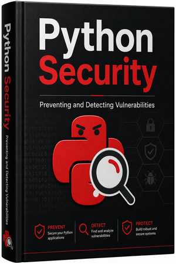

# Python Security Handbook

**A practical, no-nonsense guide to writing secure Python code in 2026 and beyond.**

 

This open-source book covers **Python Security Fundamentals** with a strong focus on real-world practices, essential security tools, and actionable security recipes.

## What You'll Learn

- Core security principles every Python developer should know
- How to secure common Python patterns and libraries
- Secure coding techniques 
- Essential open-source security tools for Python
- Practical **security recipes** – step-by-step solutions to common security challenges
- Dependency management, supply chain security, and runtime protection
- Static Application Security Testing (SAST) and Software Composition Analysis (SCA)

## Key Features

- **Fundamentals First** – Clear explanations of specific Python weaknesses, vulnerabilities, and threats
- **Secure Coding Guidelines** - The best maintained collection of guidelines to create secure Python applications
- **Practical Recipes** – Ready-to-use, secure code patterns
- **Tool Recommendations** – Focused on using the best Free and Open Source (FOSS) tools
- **Realistic Advice** – Balanced between theory and production reality
- **Regularly Updated** – Keeping pace with the evolving Python and security landscape

## Tools Featured

- **[Python Code Audit](https://github.com/nocomplexity/codeaudit)** – Best-in-class open-source Python SAST scanner
- Dependency scanners (pip-audit, Open Source Insights , etc.)
- And other essential security tools

## How to Read This Book

You can read the book online at:  
👉 **[https://nocomplexity.github.io/pythonsecurity/](https://nocomplexity.github.io/pythonsecurity/)**

## Contributing

Contributions are welcome! See [CONTRIBUTING](CONTRIBUTING.md) for details.

Simple ways to help:
- Star the repository
- Share with fellow Python developers
- Report issues or suggest improvements
- Submit pull requests for new recipes or corrections

## License

This book is licensed under [**CC-BY 4.0**](license.md) – you are free to share and adapt with attribution.

---

**Made with ❤️ to [Simplify Cyber Security](https://nocomplexity.com/simplifysecurity-manifesto/) Challenges**

Want to support the project? Consider [sponsoring](sponsors.md) or making a [donation](contribute.md).

