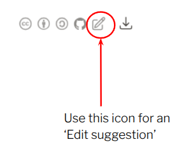

Great that you’re here and want to contribute! 

You don't have to be a security expert to contribute, every contribution is welcome!


* If you wish to make comments regarding this document, please raise them as [GitHub issues](https://github.com/nocomplexity/pythonsecurity). Send comments by email if you are unable to raise issues on GitHub do not to use Github on principle. All comments are welcome!

:::{tip} This playbook is open source. 
All contributions are welcome!
:::


## How to Contribute

This is an open-source project, and contributions from the community are warmly welcomed. Here are several simple ways you can support the book:

### Provide Feedback or Suggestions
The easiest way to contribute is to **open an issue** or suggest an edit on a specific page.

- Click the GitHub edit icon in the top-right corner of any page to propose changes directly.  



### Spread the Word
Help others discover the book by sharing it with colleagues, students, or on social media:

**Book URL:** [`https://nocomplexity.github.io/pythonsecurity/`](https://nocomplexity.github.io/pythonsecurity/)
```
https://nocomplexity.github.io/pythonsecurity/
```


### Support the Project
- Give the project a star on [GitHub](https://github.com/nocomplexity/pythonsecurity) — it helps increase visibility.
- Use [Python Code Audit](https://github.com/nocomplexity/codeaudit), the leading open-source Python SAST scanner, and consider starring it as well.

### Other Ways to Contribute
- Advocate for secure Python programming practices in your workplace and community.
- Consider making a [donation](https://buy.stripe.com/fZu6oHcNWckg7SH5uAgbm04) to support ongoing maintenance and improvements.
- If you represent an organisation, you can [sponsor](sponsors) the book by placing an ethical advertisement in the appendix.

Every contribution — no matter how small — helps improve the quality and reach of this resource.


## Pay what you can 

**Cybersecurity education shouldn't be a luxury.**

*If you can, your support makes a meaningful difference.*
 
:::{include} donate.md

:::

(contributors)=
## Contributors

The following people have contributed their expertise to make the world — partly powered by Python software — a bit more secure by contributing to this *Python Security Handbook*.

Thank you to everyone who has helped to improve the security of the Python ecosystem!


[name or alias] [OPTIONAL: Website] [OPTIONAL: Organisation name]

- Fiona
- Albert

If you would like your name to appear here: this publication is open source [(CC BY-SA)](license). Issues and pull requests are welcome! All contributors will be added to this list.
