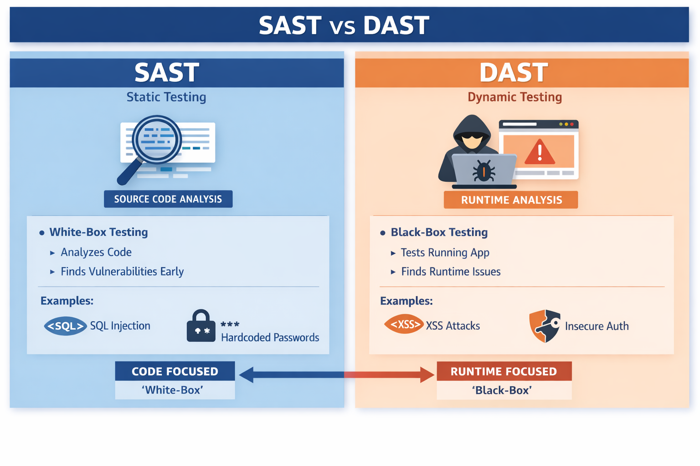

## Introduction

:::{note} Definition
DAST tests a running Python application to identify security vulnerabilities that only become visible at runtime.
:::

The purpose of DAST is to simulate real-world attacks and observe how the application behaves under malicious input or unexpected conditions.

### How DAST for Python works

- Sends crafted test inputs to the running application (for example HTTP requests, form data, API calls, or other simulated user interactions).
- Monitors the application’s responses and behaviour for security issues such as cross-site scripting (XSS), SQL injection, authentication and authorisation flaws, insecure redirects, or denial-of-service conditions under load.
- Operates as a black-box technique: it does not require access to the source code.

**Example**  
Testing a Python web application (Flask, Django, or FastAPI) by submitting malicious form inputs and crafted HTTP requests to check for XSS, open redirects, or injection vulnerabilities.

## SAST vs DAST for Python applications

SAST is a white-box approach that analyses source code without executing it. It is straightforward to introduce early in the development lifecycle and provides high value for catching issues before they reach runtime.

DAST is a black-box approach that exercises the live application. Mature, language-agnostic tools such as OWASP ZAP, Burp Suite, and Nuclei work effectively against Python web frameworks. Purpose-built Python-only DAST scanners are less common, but the general-purpose tools cover the majority of practical needs.

For any Python application SAST and DAST are complementary and recommended from a security perspective.

| Aspect                      | SAST (Static Application Security Testing)                                      | DAST (Dynamic Application Security Testing)                                      |
|-----------------------------|---------------------------------------------------------------------------------|----------------------------------------------------------------------------------|
| **Approach**                | White-box   | Black-box: tests the running application by sending inputs and observing behaviour |
| **When performed**          | Early (coding / CI stage) – “shift-left”                                        | Later (running application, staging, or production-like environment)             |
| **What it examines**        | Python source (`.py`), dependencies, configuration files                        | HTTP endpoints, APIs, runtime behaviour of a live Python process                 |
| **Typical Python tools**    | [Python Code Audit](https://nocomplexity.com/codeaudit/)         | OWASP ZAP, Burp Suite, Nuclei, custom scripts against Flask/Django/FastAPI apps  |
| **Vulnerabilities found**   | Hard-coded secrets, use of `eval`/`exec`/`pickle`, insecure deserialisation, weak cryptography, SQL-injection patterns in code, dependency CVEs | Runtime injection (SQLi, command injection), XSS, authentication/authorisation flaws, insecure headers, business-logic issues |
| **False-positive rate**     | Higher (static analysis can miss context)                                       | Lower for reachable issues, but may miss unexercised code paths                  |
| **Coverage**                | Entire codebase, including unexecuted paths                                     | Only exercised code paths and exposed interfaces                                 |
| **Requires running app?**   | No                                                                              | Yes                                                                              |
| **Best suited for**         | All Python code(parts), applications, libraries, scripts, CLI tools, and for early detection in CI                | Large systems with Python code, Python based Web applications (Django, Flask, FastAPI), APIs, microservices (with Python backend)                   |
| **Limitations for Python**  | Python dynamic features (`getattr`, metaclasses, runtime code generation) | Limited insight into internal Python logic; less effective for non-HTTP interfaces |
| **Integration**             | Easy in pre-commit hooks                 | Requires a deployed environment; typically run as part of security testing workflows. |

