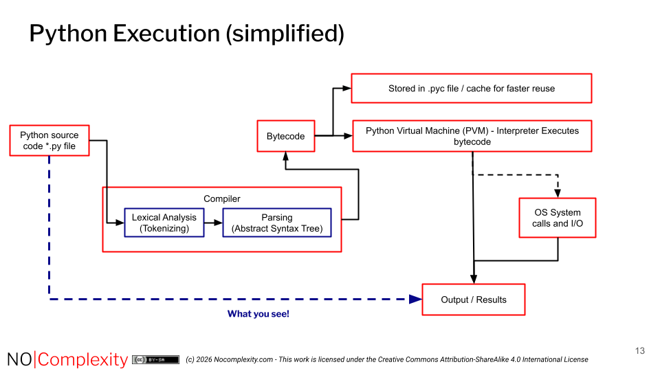
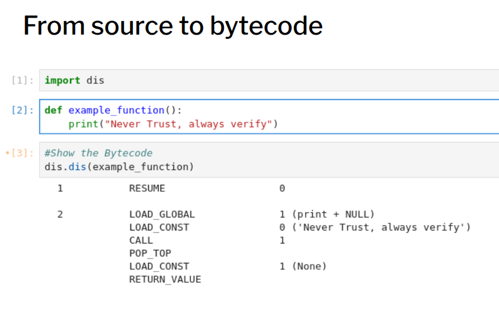

# Python Execution Model

You cannot understand specific Python security vulnerabilities without better understanding how Python runs. This section should cover the bytecode compilation, the PVM (Python Virtual Machine), and how Python handles memory and dynamic typing.

To understand which security threats are relevant to Python code, knowledge of the internal workings of the Python interpreter is required. 

:::{note} 
Understanding how Python source files (`*.py`) are executed is crucial from a security point of view.
:::

The default and most widely used interpreter is CPython, distributed by the Python Software Foundation (PSF). The core CPython source code cannot be easily compromised; multiple defensive measures are taken to prevent weaknesses in the code and to protect against supply chain attacks. While trust is essential, verification is better: the open-source nature of Python allows anyone to inspect the code or validate the PSF’s processes if required.

Most secure Unix distributions and all BSD systems require that CPython is built from source. Some distributions use reproducible builds to minimise the risk of supply chain attacks on the CPython code.

While Python is an interpreted language, it involves a compilation step where source code is converted into bytecode (`.pyc`). This bytecode is then executed by the Python Virtual Machine (PVM).

Detailed Execution Steps:

**Detailed Execution Steps**

1. **Source Code**  
   Python programs begin as human-readable `.py` files containing the source code written by the developer.

+++

2. **Compilation to Bytecode**  
   When the program runs, the Python compiler performs lexical analysis (tokenizing) and parsing to build an Abstract Syntax Tree (AST). It then generates platform-independent bytecode — a set of intermediate instructions designed for the Python Virtual Machine. Syntax errors are detected during this phase.  
   Bytecode is cached in `.pyc` files inside a `__pycache__` directory for faster loading on subsequent runs (primarily for imported modules). When a script is executed directly (e.g., `python myscript.py`), the bytecode is normally compiled and kept only in memory; no `.pyc` file is written unless the module is imported and caching is enabled (the default).

+++

3. **Execution by the Python Virtual Machine (PVM)**  
   The bytecode is handed to the Python Virtual Machine (the interpreter). The PVM reads and executes the bytecode instructions one by one. During execution it may issue operating-system system calls and perform I/O operations.

+++

4. **Output / Results**  
   The final results of the program are produced and made visible to the user. The intermediate stages (compilation, bytecode, and PVM execution) remain hidden — the developer and user primarily see only the original source code and the eventual output.

+++

This flow ensures that Python is platform-independent at the bytecode level, as any system with a compatible PVM can run the same bytecode.

CPython is the reference implementation written in C. CPython functions as both a compiler and an interpreter. It first compiles Python source code into an intermediate format called bytecode, which is then executed by the Python Virtual Machine (PVM), a runtime environment written in C.

Python Code goes through parsing, complication and execution. Bytecode is the intermediate representation.

CPython is a stack based virtual machine. This means that it executes instructions using a **Last-In, First-Out (LIFO) stack data structure** to store and retrieve data, rather than using general-purpose registers. 

Inside the CPython VM, each function call has an associated "frame," which contains a specific "evaluation stack" (or "value stack"). This is where most of the work happens.

The Python Virtual Machine (PVM), which is part of the **CPython interpreter**, is written in the **C programming language** and uses the standard **C API** and **C runtime library** to make calls to the operating system.  So instead of talking to the OS directly from Python code (which would not be platform-independent), the PVM includes an implementation layer (written in C) that uses the underlying OS's own Application Programming Interface (API) to perform tasks using the Operating System.

So Python's execution model combines interpretation with compilation. The Bytecode is an intermediate representation between the high-level Python source code and machine code. 
Bytecode is the intermediate representation that the PVM executes. The bytecode is more efficient to run compared to interpreting the source code directly.

Below is an example how you can see how Python code is compiled to bytecode:

