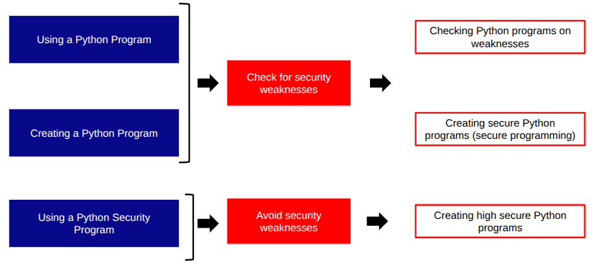

There are three key types of Python security checklists:

1. **Pre-use checklists** – for reviewing and validating an existing Python program before deployment or use.  
2. **Secure development checklists** – for creating robust and secure Python applications from the ground up.  
3. **Security application checklists** – for projects where the Python code itself forms part of a security tool or system.

Cybersecurity checklists are essential for minimising risk and preventing costly, avoidable security incidents. A well-designed, clear, and practical checklist serves as a powerful tool to support consistent, high-quality security practices.

In many mature professions, checklists have become a mandatory safeguard against disaster. Aviation, surgery, structural engineering, and the automotive and rail industries all rely heavily on disciplined checklist procedures to prevent catastrophic failures.

:::{toc}
:context: children
:::
