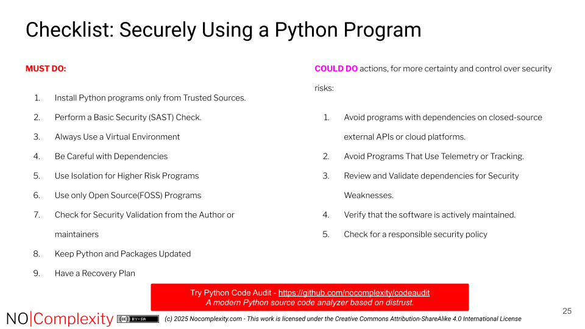

This checklist is designed to help prevent security issues before running an unknown or third-party Python program.

This checklist covers key security principles for safely running Python programs.

So this means if you want to avoid security risks when using Python programs:

## Must do actions

### 1. **Install Python programs only from trusted sources**.

    Use only official, managed repositories such as:
    -    PyPI.org
    -    conda
    -    conda-forge
    Never download or execute Python programs from untrusted websites, random forums, or unknown Git repositories. This helps reduce the risk of supply chain attacks that could compromise your system.

Only run Python scripts if you fully understand what they do and where they came from.

+++

### 2. **Perform a basic security (SAST) check.**

- Use a well-maintained, 100% Open Source, Python-specific static analysis tool to scan the Python code before running it.

:::{tip}
Recommended is: [Python Code Audit](https://github.com/nocomplexity/codeaudit) This open source SAST tool is created for users of Python programs to check security weaknesses. You do not have to be a security expert to use this tool.
:::

Avoid running Python scripts that show warnings or ask an expert to explain the warnings for you.

+++


### 3. **Always use a virtual environment**:

- Run Python programs inside a virtual environment such as `venv` or `conda`.

- This isolates the program from your system’s global Python installation.
- **Never** run unknown Python programs as Administrator or with high privileges. If possible, create a separate user account with minimal privileges just for running unknown programs.
- The Python program should not need unrestricted access to your files, network, internet connection, camera, or microphone.

:::{note}
While creating and using a Python virtual environment is an important practice, it is far from sufficient on its own from a security perspective.
:::


+++


### 4. **Be Careful with dependencies**

- Only use programs that can install their dependencies via:
```
pip install <package>
```

or:

```
conda install <package>
```

Avoid software that requires manual installation of system libraries or packages outside these tools — unless done in an isolated environment such as a virtual machine, container, or BSD jail.

+++

### 5. **Use isolation for higher risk programs**


For robust security, do not rely on Python itself for sandboxing. So encapsulate the runtime CPython environment in a dedicated, externally managed sandbox. This design ensures that the Python environment remains isolated, significantly reducing the risk of exploitation.  


If your SAST scan raises any concerns, run the program in an isolated environment, such as:
-    A virtual machine (VM)
-    A container (Jail, Docker)

The isolated environment should:
-    Prevent privilege escalation
-    Limit resource usage (CPU, storage, network)
    
- Avoid granting the program access to system folders, USB drives, or cloud storage.

:::{caution}
 Never ever run Python programs as ‘administrator’ ,‘root’ or any other high privilege user. Some programs asks for a ‘sudo’ password, Do not use these programs, unless you have inspected the code and understand the consequences and dangers!
:::

So always implement privilege separation outside Python by running it within a sandboxed environment. This reduces risks by isolating the Python process from critical system resources.  


+++


### 6. **Use Open Source(FOSS) programs**

- Choose programs that are free and open source software (FOSS), including all dependencies.

This allows the code to be inspected and audited for security issues when needed.

- Avoid closed-source or “mystery” Python scripts that claim to be safe without transparency.


FOSS software is not automatic more secure that commercial software. But having the source code is available means it is easier to evaluate security aspects. Transparency is a key pillar in building trust and validating security claims.

+++

### 7. **Check for security validation from the author or maintainers**:

    - Verify if the program has been scanned for security weaknesses by its creator.
    - Look for a “Python Code Audit Badge”:

    - or similar trusted security validation indicator.
    
    If you cannot find such a badge, ask the creator:
    -    What SAST tool was used?
    -    Can they share a scan report for the released version?

+++


### 8. **Keep Python and packages updated**

- Regularly update your Python installation and dependencies to fix known security issues:

```
pip list –outdated
```
or 

```
pip install –upgrade <package>
```

- Only install updates from trusted repositories.

9. **Have a recovery plan**

 -  Always back up important files and data before running new software.

If something suspicious happens when running a Python program, disconnect from the internet *immediately*.


## Could do actions

When you want more certainty and control to prevent security risks, consider taking the following additional measures.


### 1. **Avoid programs with dependencies on closed-source external APIs or cloud platforms.**

- Distrust Python programs that rely on external APIs, web services, or cloud platforms that you cannot inspect or verify.
    This includes programs that use external authentication services (e.g., logging in with third-party accounts).

Such connections may expose sensitive data or create dependencies on systems outside your control.

+++


### 2. **Avoid programs that use telemetry or tracking**

-  Avoid Python programs that collect telemetry or usage data.

These features often share information about your system or activity without full transparency. Even when intended for diagnostics, telemetry can reduce privacy and increase security risks if data is intercepted or misused.

+++

### 3. **Review and validate dependencies for security weaknesses**

- Understand and check the program’s dependencies for known security vulnerabilities. Python Code Audit has a simple feature to check Python packages on known vulnerabilities (REF)
- Validating dependencies means more than reviewing a Software Bill of Materials (SBOM) — an SBOM lists components but doesn’t ensure they are safe.
- SBOMs can be useful for awareness, but do not guarantee trustworthiness or the absence of security flaws.

+++

### 4. **Verify that the software is actively maintained**

- Even small Python projects should be actively maintained.
- A well-maintained project should at least validate correct functionality once per year.
- A quick ways to assess maintenance health:
    -   Look at the project’s last commit date.
    -   Review open issues or pull requests on its repository.
    -   Frequent unresolved security or dependency issues can indicate neglect.

+++


### 5. **Check for a responsible security policy**

- Confirm whether the project has a defined procedure for handling security issues.
- Responsible projects provide a private reporting channel (e.g., email or “security.txt” or “security.md” file with instructions).
- Security issues should **never** be reported publicly before they are fixed, to prevent exploitation.


