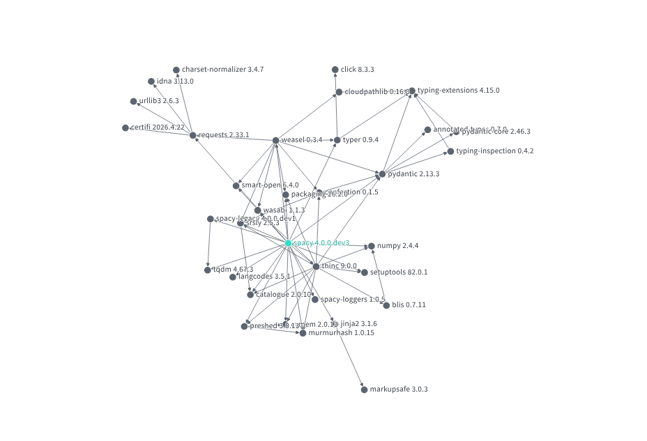

The security of nearly all Python applications depends on two critical factors:

1. The development and maintenance processes used.
2. The quality and security of the dependencies they rely upon.

One of the fastest and most effective ways to assess dependency risk is through **Google Open Source Insights** (commonly known as **deps.dev**).

:::{tip} **Try it here**:
Use: [Google Open Source Insights](https://deps.dev/)
:::

## What is Open Source Insights?

Open Source Insights is a free public service developed and maintained by Google. It analyses open source packages across multiple ecosystems, builds complete dependency graphs, and surfaces rich security, licensing, and maintenance information.

Unlike many dependency scanners that only check direct dependencies listed in your `pyproject.toml` or `requirements.txt`, Open Source Insights provides a **full transitive view** of your dependency tree. It draws on high-quality data from OSV (Open Source Vulnerabilities) and other sources, giving you a much more complete picture.

## Key Features

- Interactive dependency graphs showing both direct and transitive dependencies
- Support for multiple ecosystems (Python, npm, Go, Maven, Cargo, etc.)
- Rich metadata including:
  - Known vulnerabilities (via OSV)
  - OpenSSF Scorecards (where available)
  - Licence information
  - Project popularity and ownership details
- Daily updates
- Free public web interface with no installation required
- BigQuery dataset available for advanced analysis

## Valuable Insights for Python Projects

When you look up a package, Open Source Insights provides several key pieces of information:

**OpenSSF Scorecard**  
Where available, this gives an objective assessment of the project’s security practices (e.g. use of CI/CD, code review, vulnerability disclosure, etc.). Note that many smaller projects do not have a Scorecard.

**All Dependencies**  
You can explore both **direct** and **indirect (transitive)** dependencies in a clear table or through an intuitive visual graph. This is particularly useful for understanding the true attack surface of your project.

:::{note}
:class: dropdown
**Dependency definition**  
A dependency is any external package required for your code to function.  
- **Direct dependencies**: explicitly declared in your project.  
- **Indirect (transitive) dependencies**: pulled in automatically by your direct dependencies.  

Open Source Insights excels at visualising the full dependency graph.
:::

**Example**: [Dependency graph for spaCy](https://deps.dev/pypi/spacy)

**All Dependents**  
This shows how many other packages rely on a given library — a strong indicator of its importance in the Python ecosystem.

:::{note}
:class: dropdown
**Dependents definition**  
A *dependent* is the inverse of a dependency. Packages with many dependents are often critical infrastructure. A vulnerability in such a package can have widespread impact.
:::

**Security Advisories**  
Any known vulnerabilities are clearly listed, with links to detailed advisories.

Understanding both your dependencies *and* their transitive relationships is essential. Many serious supply chain attacks exploit indirect dependencies that teams are unaware they are using.

:::{important}
Using **Open Source Insights** should be a standard part of your dependency evaluation process. It provides excellent visibility and should be combined with other practices such as static code analysis (SAST) and regular vulnerability scanning.
:::
